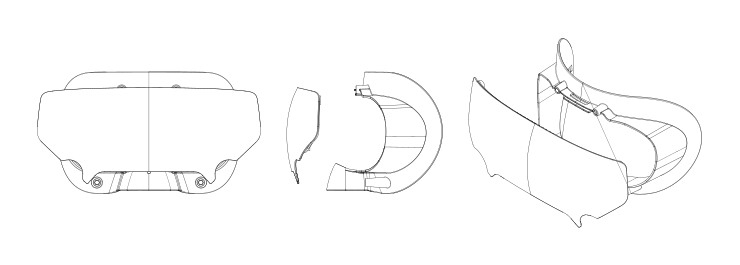
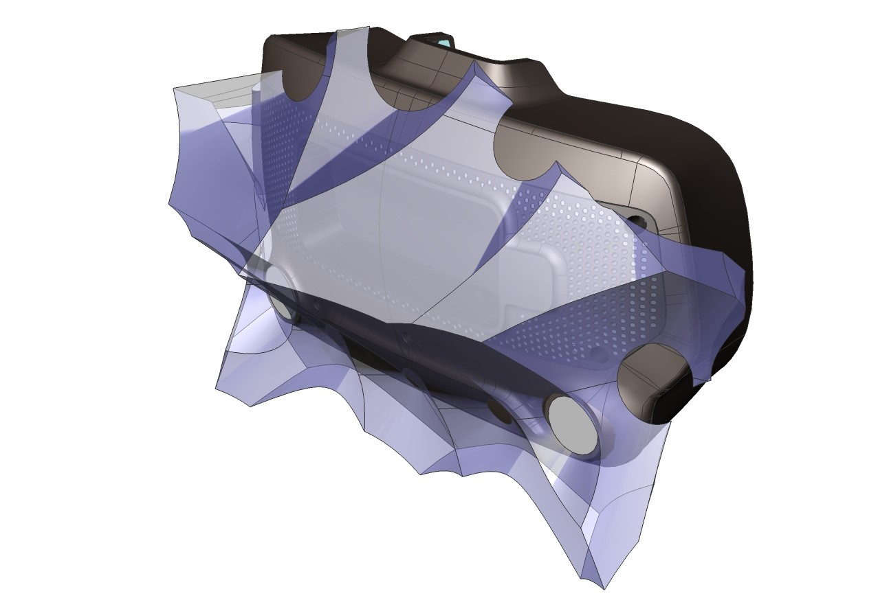
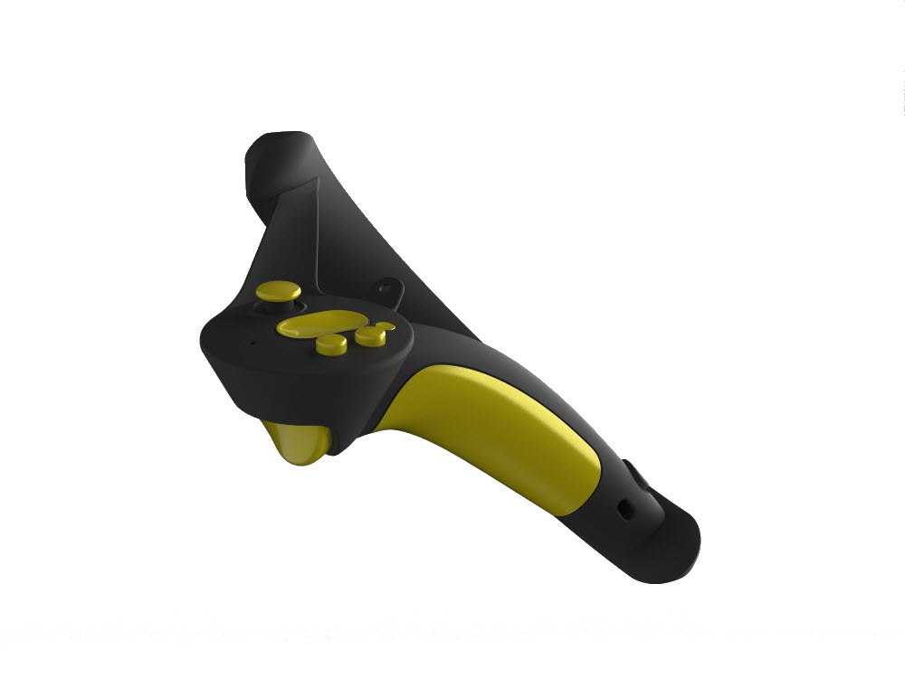

# Index Hardware CAD

This repository contains the mechanical CAD for components of all three primary products in the [Valve Index VR system](https://www.valvesoftware.com/en/index) (controller, headset, and base station), under a Creative Commons license.  We're looking forward to seeing what the community creates!  Please reach out to us at SteamHardwareFeedback@valvesoftware.com with any questions, feedback, requests, and most importantly, interesting creations.

Each folder contains high resolution step models.  We've also provided drawings and low resolution STL models for documentation and reference.  

## Headset

### Frunk

The [Frunk](Headset/frunk_ref_drawing.pdf) is the volume in the front of the headset meant to host accessories.  It has a USB 3 type A port capable of 1A@5V piped back to the host computer.

For larger creations, please see the [sensor inclusion zone model](Headset/index_hmd_accessory_inclusion_zone.stp.zip).  This model represents the volume that your design can occupy without occluding cameras or sensors.

If your creation attaches elsewhere, we recommend routing the USB cable directly out the side towards the eye-relief adjustment knob in order to minimize the chance of occlusion.

We strongly recommend against removing the frunk plastic, as it can impact your sensor calibration and will void a warranty you may otherwise enjoy.  Anything that requires a T5 or smaller is not user serviceable.

### Visor

The [Visor](Headset/index_hmd_visor.stp.zip) is held in place with 4 magnets for easy removal and replacement.  Although the shipping visor is translucent, you can customize this without fear of occlusion - no sensors or cameras look "through" the visor.

### Face Gasket

The [Face Gasket](Headset/index_hmd_facegasket.stp.zip) also is held in place by magnets for easy removal and replacement. The CAD will allow you to recreate the surface and features to attach to the HMD, allowing you to create your own personalized face gasket.

### Head Strap & Audio

The head strap has several degrees of freedom in order to accomodate a wide range of sizes and shapes.  

Removing the audio drivers can be accomplished with a T6 Torx driver.  Hold the support arm in place while loosening the screw, and pull straight out.  The pogo pins that carry the audio signal are not designed for lateral loads.

To reattach an audio driver, first align the pogo pins with the gold contacts.  Hold the contacting surface against the head strap while gently tightening the screw.

Removing the headstrap is not recommended.  To do so, first adjust the eye relief to its furthest out position.  Then pull the eye relief adjustment knob straight off, taking care not to torque it.  This reveals two T6 screws and an alignment post.  The left side is removed by undoing another T6 accessible by a small port adjacent to the eye tube.  This is a captured screw, do not attempt to fully remove it.  Also, do not attempt access through the apparently symmetric port on the right side, as this does not contain accessible components.

To reattach the headstrap, take care to align the alignment posts and avoid excessive force.  Place the left side on the support post and gently press in while rotating to align to the alignment post.  This should smoothly glide in when done correctly.  Screw in the two T6.  The right side is slightly harder because the alignment post is not visible.  Use the same gentle push and rotation method, and secure via the captured screw.

## Controller

The left and right hand controllers are mirror symmetric with each other.  All of the provided models are of the right hand variant.

Every input of the controller has capacitive sensing: the thumbstick, trackbutton, trigger, grip, and buttons. We recommend keeping these surfaces clear.

The [sensor inclusion zone model](Controller/index_controller_inclusion_zone.stp.zip) shows the available volume to work with to not occlude any of the tracking sensors.  Unsurprisingly, it looks a bit like a forearm and hand.  

Some large accessories will exceed this volume.  During your design process for these:
1. Consider what positions are important for your gameplay.
3. Avoid shiny or reflective surfaces outside the inclusion zone.
3. Experiment.

The [accessory example](Controller/index_controller_example.stp.zip) is a "Booster" for the Index Controller. The Booster is essentially a shell that wraps around the grip portion of the Index Controller. It serves two primary functions:

1. For people with longer thumbs, the handle booster shifts the hand backwards a bit to place the buttons and thumb stick closer to the thumb tip. It may also make the grip more comfortable for those with larger hands, particularly during longer play sessions.
2. The handle booster provides a reference design for anyone wishing to create a mechanically mounted accessory to the Index controller in a way that doesn’t directly interfere with or occlude any of the optical tracking sensors, finger sensors, or input controls. This is valuable because any given controller design must trade-off between tool vs hand presence, and an accessory allows a user to quickly adapt it to any number of applications.

## Basestation

The Basestation has a pair of 1/4-20 UNC x_______ threaded holes for mounting - this is the same standard many cameras use, so you may find off-the-shelf devices that already fit your need. 
